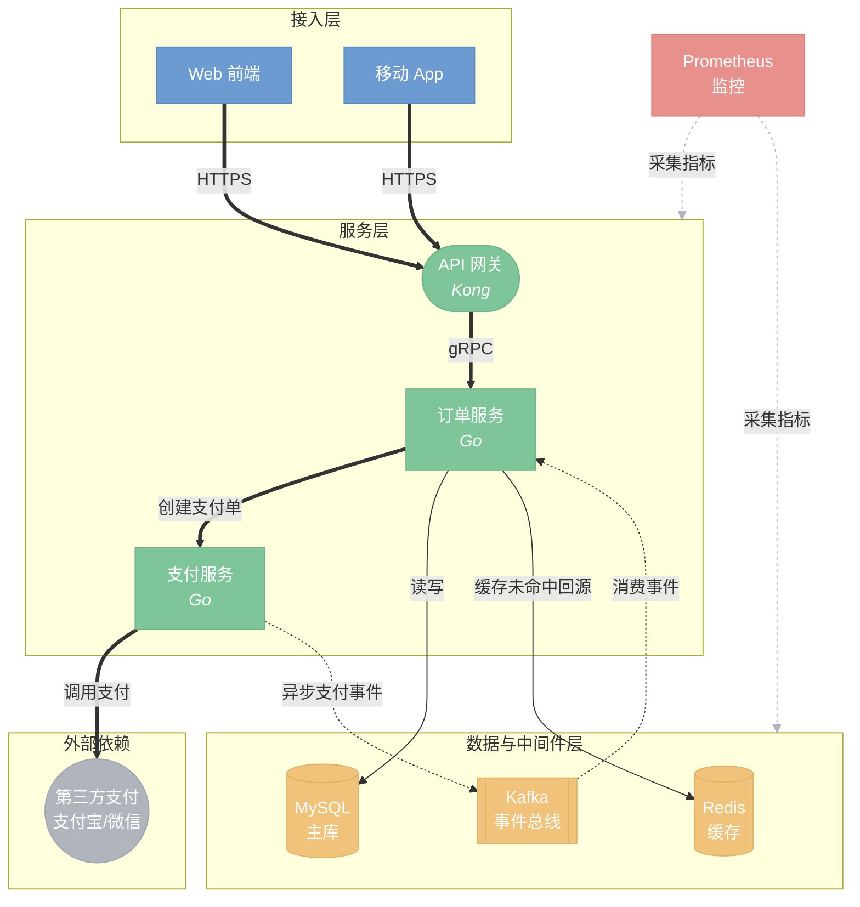

# Architecture Mermaid

## Overview

An architecture diagram reads as senior work when its **visual structure mirrors the system's logical structure**, not because it has more colors or fancier syntax. Amateurs lay every element flat, color randomly, and connect everything to everything. Architects encode meaning: layers become regions, categories become colors, importance becomes visual weight, and the main data flow is unmistakable.

**Core principle: information layering + consistent semantic encoding.** Every visual choice (color, shape, line style, direction) must carry meaning. If a choice carries no meaning, remove it.

**Layout constraint (aligns with global CLAUDE.md):** prefer a balanced, roughly square aspect ratio with `flowchart TB`. Use `LR` only as a last resort when a balanced layout is genuinely unachievable — not by default, even for "pipeline" or "architecture" diagrams.

## When to Use

- Drawing system architecture: services, components, queues, stores, external deps, deployment/trust boundaries.
- Drawing a framework or library's internal structure: abstraction layers, module dependencies.
- An existing architecture diagram is flat, colorless, a tangle of crossing arrows, or you can't tell the main flow at a glance.

**When NOT to use:** call chains / message passing → `sequenceDiagram`; state transitions → `stateDiagram`; pure data relationships → `erDiagram`. This skill is for architecture/framework/module structure.

## The 6 Rules (in priority order)

These are ordered by how much they separate senior output from amateur output. Rule 1–3 are what baselines fail hardest.

### 1. Layer with subgraphs; keep flow single-directional

Group nodes into `subgraph` layers that map to real logical/deployment layers (e.g. access / service / compute / storage / infra). Data should flow in **one dominant direction** across layers. Do not let arrows cross into a net.

**Balanced-aspect technique:** keep the outer chart `TB` (layers stack vertically) but set `direction LR` inside each subgraph so nodes within a layer spread horizontally. This is the primary lever for hitting a near-square aspect ratio while staying TB — reach for it before ever considering an outer `LR`.

```
flowchart TB
  subgraph L1["接入层"]
    direction LR
    A1["Web"]
    A2["App"]
  end
  subgraph L2["服务层"]
    direction LR
    B1["订单服务"]
    B2["支付服务"]
  end
  L1 ==> L2
```

**Edge to a whole layer, not every node:** when a source feeds an entire layer, draw one edge to the subgraph id (`SRC ==> ING`) instead of fanning to each node — this keeps the main path clean.

### 2. Color is a classification dimension, not decoration

**Before coloring, decide what dimension the color encodes** (which layer / which responsibility / which team / internal-vs-external). Same category → same color; different category → different color. Never color node-by-node. Cap at 5 colors.

Use this palette (matches global CLAUDE.md):

```
classDef primary fill:#6C9BD2,stroke:#5B8AC1,color:#fff
classDef success fill:#7EC699,stroke:#6DB588,color:#fff
classDef warning fill:#F0C27A,stroke:#DFB169,color:#fff
classDef danger  fill:#E8918C,stroke:#D7807B,color:#fff
classDef grey    fill:#B0B5BD,stroke:#9FA4AC,color:#fff
```

### 3. Main path gets visual weight; label every edge

- **Main data/business flow**: thick arrows `==>`, most saturated color.
- **Side/async/fallback/control flow**: dotted `-.->`, low-saturation or grey.
- Every edge carries a label saying **what flows / trigger condition** (`gRPC`, `CDC 同步`, `缓存未命中`, `异步事件`). A bare arrow in an architecture diagram = missing information.
- Separate **data flow** from **control flow** (scheduling, monitoring, governance). Use `linkStyle` or dotted lines so they don't read as the same thing. Monitoring/governance edges fanning to every node is the #1 source of visual noise — draw them dotted+grey, or point them at the subgraph, not every node.

### 4. Make system boundaries visible; weaken external deps

External systems / third-party dependencies get a **uniform weakened style** (grey, rounded or circular) distinct from in-house components — so the system boundary is obvious at a glance. Frame trust/deployment boundaries (VPC, AZ, public/internal) with titled subgraphs; architecture reviewers care about these most.

### 5. Control scale: 7–12 core nodes; drill down when larger

Target 7–12 core nodes per diagram (soft target — ERDs/sequences may legitimately exceed). When a system is bigger, split into **main diagram + detail diagrams** and annotate the main node (e.g. `订单服务<br/><i>详见图 2</i>`). One diagram = one abstraction level: never mix module-level and function-level detail in the same picture.

### 6. Consistency and self-containment

- Same category → identical shape, color, naming style across the whole diagram. Inconsistency looks more amateur than plainness.
- Carry two-level info in a node with `<br/>`: `API 网关<br/><i>Kong</i>` (logical name + tech choice), giving both a logical and a technical view.
- Shapes are semantic: `[矩形]` service/process · `([圆角])` API/interface · `[(圆柱)]` database/store · `{菱形}` decision · `[[双框]]` queue/broker · `((圆))` external system/start-end.
- The diagram must self-explain: a title, and a legend when color/line meaning isn't obvious.

## Gold-Standard Example

A system architecture applying all 6 rules. Note: TB balanced layout, layered subgraphs, semantic color, weighted main path (`==>`), labeled edges, dotted+grey control flow, weakened external deps, node-internal tech annotations.



## Common Mistakes

| Mistake | Fix |
|---------|-----|
| No `classDef`, everything one color | Color by layer/responsibility; decide the dimension first |
| Main flow same weight as side flow | Main path `==>` saturated; side/async `-.->` grey |
| Bare arrows with no labels | Label what flows / the trigger on every edge |
| Monitoring/governance fanned to every node | Dotted+grey, or point at the subgraph not each node |
| External deps styled like internal ones | Uniform weakened grey/circular style |
| 30+ nodes crammed in one picture | 7–12 core nodes; split into main + detail diagrams |
| Mixing module-level and function-level detail | One diagram = one abstraction level |
| Defaulting to `LR` for "architecture" | Prefer balanced `TB`; `LR` only as last resort |
| Random per-node shapes/colors | Same category → identical shape + color |

## Before Delivering

Validate the diagram renders using the **mermaid-sop-check** skill (SOP render validation) before handing it over. A diagram that doesn't compile is worthless regardless of how good the design is.
